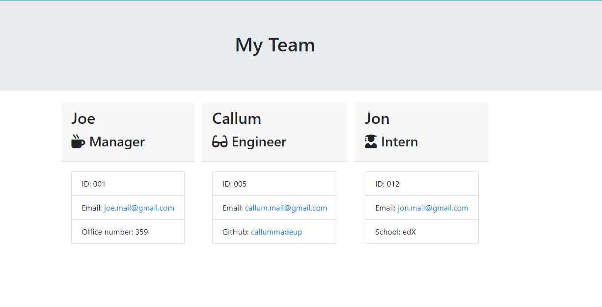

# company-employees-visualiser
A console app that takes inputs from a user based on a series of prompts using inquirer and node.js, and visualises the list of added company employees on a stylish html page

Tests were written using Jest prior to development to ensure the app worked as intended

## Deployment

__[Github Repository](https://github.com/jbkennaugh/weather-forecast/)__

__[Deployed Website](https://jbkennaugh.github.io/weather-forecast/)__

## Screenshots 

You can find the above webpage generated by this program in the "./output" directory

## License

Please refer to the LICENSE in the repository